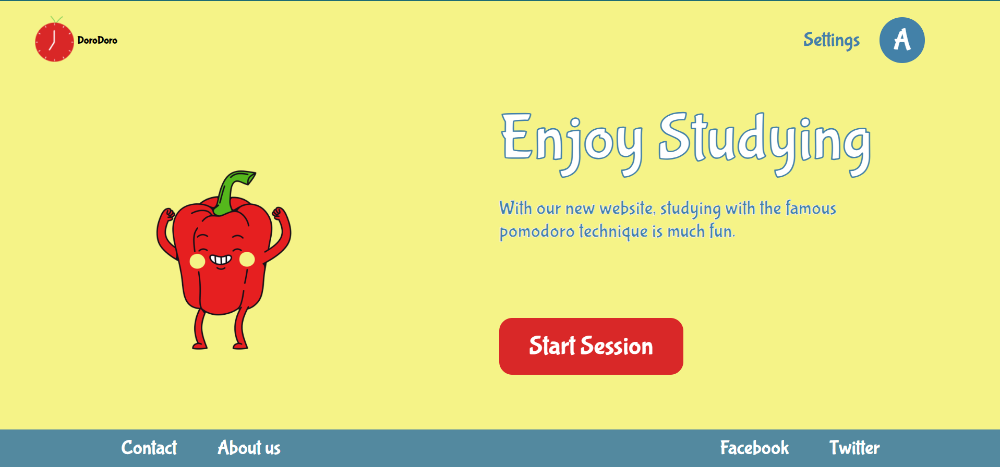

<div align="center">
<h1 align="center">

<br>dorodoro</h1>
<h3>◦ <a href='https://dorodoro-1234.web.app/'>Visit webApp</a></h3>
<h3>◦ Developed with the software and tools below.</h3>

<p align="center">


</p>


</div>

---

## 📖 Table of Contents

- [📖 Table of Contents](#-table-of-contents)
- [📍 Overview](#-overview)
- [📦 Features](#-features)
- [📂 Repository Structure](#-repository-structure)
- [📄 License](#-license)

---

## 📍 Overview

It is a project I did with a friend, she did the design and I coded the website. The intention was to simulate a Client/Developer experience and get as close to what the client wanted as possible.

I was free to use any technologies I wanted, but I wanted to fine-tune the basics and went with HTML/CSS/JS stack alongside Firebase which I used for hosting and auth.



---

## 📦 Features

- The Pomodoro logic is quite simple to understand, but I tried adding some customization to give the end user more control and personalization.
- I played a little with animation to get that timer animation working and synching with the timer.
- The Firebase integration was quite straightforward although I faced some unusual errors but nothing was impossible.
- Getting the grasp over the Flexbox
- Small transition here and there

## TODOS

This project isn't 100% done actually its not even fully usable as of now (10/10/2023):

- There are like 0 tests.
- It still needs more transitions and fluidity.
- There are some bugs here and there like when you skip all the pomos it doesn't restart.
- This website isn't responsive nor adaptive, It was developed for large 1080p screens and Chromium browsers.
- The auth isn't quite there either, there isn't enough logic or security except for the one provided by Firebase.

---

## 📂 Repository Structure

```sh
└── dorodoro/
    ├── .firebase/
    │   └── hosting.cHVibGlj.cache
    ├── .firebaserc
    ├── .gitattributes
    ├── .gitignore
    ├── .hintrc
    ├── firebase.json
    ├── image.png
    ├── jsconfig.json
    ├── LICENSE
    ├── package-lock.json
    ├── package.json
    ├── public/
    │   ├── about.html
    │   ├── assets/
    │   ├── index.html
    │   ├── scripts/
    │   ├── settings.html
    │   ├── signIn.html
    │   ├── signUp.html
    │   ├── squeleton.html
    │   ├── start.html
    │   ├── startSession.html
    │   └── styles/
    └── README.md
```

---

## 📄 License

This project is licensed under the `MIT License` License. See the [LICENSE-Type](LICENSE) file for additional info.

[↑ Return](#Top)
