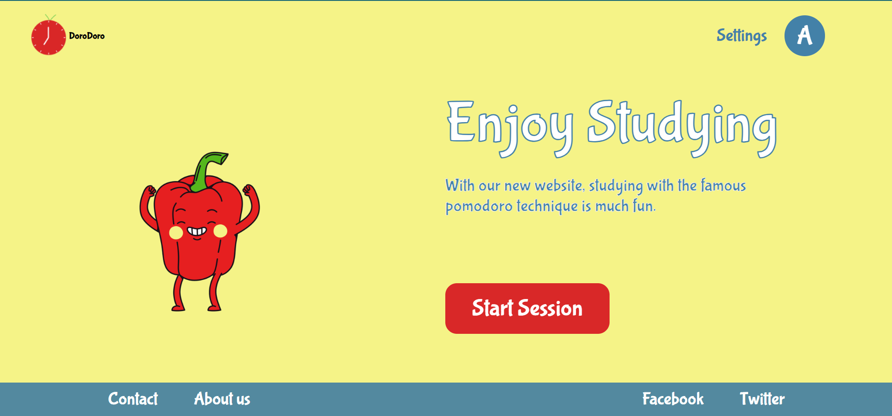

<div align="center">
<h1 align="center">

<br>DoroDoro</h1>
<h3>◦ <a href='https://dorodoro-1234.web.app/'>Visit webApp</a></h3>
<h3>◦ Developed with the software and tools below.</h3>

<p align="center">


</p>


</div>

---

## 📖 Table of Contents

- [📖 Table of Contents](#-table-of-contents)
- [📍 Overview](#-overview)
- [📦 Features](#-features)
- [📂 Repository Structure](#-repository-structure)
- [📄 License](#-license)

---

## 📍 Overview

It is a project I did with a friend, she did the design and I coded the website. The intention was to simulate a Client/Developer experience and get as close to what the client wanted as possible.

I was free to use any technologies I wanted, but I wanted to fine-tune the basics and went with HTML/CSS/JS stack alongside Firebase which I used for hosting and auth.



---

## 📦 Features

- The Pomodoro logic is quite simple to understand, but I tried adding some customization to give the end user more control and personalization.
- I played a little with animation to get that timer animation working and synching with the timer.
- The Firebase integration was quite straightforward although I faced some unusual errors but nothing was impossible.
- Getting the grasp over the Flexbox
- Small transition here and there

## GitHub Deployment

GitHub Actions deploys this project to Firebase Hosting.

- Pushes to `master` deploy the live site.
- Pull requests deploy a Firebase preview channel and update it on each new commit.

To make the workflows run in GitHub, add this repository secret:

- `FIREBASE_SERVICE_ACCOUNT_DORODORO_1234`: JSON credentials for a Firebase service account with Hosting deploy access to the `dorodoro-1234` project.

## TODOS

This project isn't 100% done actually its not even fully usable as of now (10/10/2023):

- There are like 0 tests.
- It still needs more transitions and fluidity.
- There are some bugs here and there like when you skip all the pomos it doesn't restart.
- This website isn't responsive nor adaptive, It was developed for large 1080p screens and Chromium browsers.
- The auth isn't quite there either, there isn't enough logic or security except for the one provided by Firebase.

---

## 📂 Repository Structure

```sh
└── dorodoro/
    ├── .firebase/
    │   └── hosting.cHVibGlj.cache
    ├── .firebaserc
    ├── .gitattributes
    ├── .gitignore
    ├── .hintrc
    ├── firebase.json
    ├── image.png
    ├── jsconfig.json
    ├── LICENSE
    ├── package-lock.json
    ├── package.json
    ├── public/
    │   ├── about.html
    │   ├── assets/
    │   ├── index.html
    │   ├── scripts/
    │   ├── settings.html
    │   ├── signIn.html
    │   ├── signUp.html
    │   ├── squeleton.html
    │   ├── start.html
    │   ├── startSession.html
    │   └── styles/
    └── README.md
```

---

## 🧠 Sessions & AI

DoroDoro is organized around **work sessions** — long-lived project containers that each own their own notes, todos, pomodoro stats, and AI chat thread. The sessions switcher lives above the focus board on `start.html`; the AI assistant is a slide-over panel opened from the sparkle FAB on both `start.html` and `home.html`.

### Data model (Firebase Realtime Database)

```
users/{uid}/
  activeSessionId
  sessions/{sessionId}/{ title, description, status, createdAt, updatedAt, archivedAt,
                         focusBoard/…, aiChat/messages/…, stats/… }
  events/{eventId}              # now carries sessionId
  statsDaily/{YYYY-MM-DD}
aiLimits/
  global/{YYYY-MM-DD}/count
  users/{uid}/{ daily/{YYYY-MM-DD}/count, monthly/{YYYY-MM}/count, lastRequestAt }
```

Rules are in [`database.rules.json`](database.rules.json). Deploy with:

```
firebase deploy --only database,hosting
```

On the first load after deploy, each signed-in user's legacy `users/{uid}/focusBoard` is migrated into a new "Default" session and the legacy path is removed.

### AI chat: Cloudflare Worker

The AI assistant proxies Gemini 2.0 Flash through a Cloudflare Worker that verifies the Firebase ID token and enforces per-user + global rate limits in RTDB. All Worker code lives in [`worker/`](worker/).

Limits: **50/day, 500/month per user; 1,000/day global; 3s cooldown**.

#### One-time setup

1. **Create a Gemini API key**: https://aistudio.google.com/apikey
2. **Create a Firebase service account**: Firebase console → *Project settings* → *Service accounts* → *Generate new private key*. Keep the downloaded JSON safe.
3. **Install wrangler & sign in**:

   ```
   cd worker
   npm install
   npx wrangler login
   ```
4. **Set secrets** (run each from inside `worker/`):

   ```
   npx wrangler secret put GEMINI_API_KEY
   npx wrangler secret put FIREBASE_PROJECT_ID      # e.g. dorodoro-1234
   npx wrangler secret put RTDB_URL                  # e.g. https://dorodoro-1234-default-rtdb.firebaseio.com
   npx wrangler secret put FIREBASE_SA_JSON          # paste the entire service-account JSON (single line)
   ```
5. **Update allowed CORS origins** in [`worker/wrangler.toml`](worker/wrangler.toml) (`ALLOWED_ORIGINS`) if your hosting domain isn't already listed.
6. **Deploy**:

   ```
   npx wrangler deploy
   ```

   Wrangler will print the Worker URL (e.g. `https://dorodoro-ai.<subdomain>.workers.dev`).
7. **Point the client at it**: open [`public/scripts/ai-chat.js`](public/scripts/ai-chat.js) and replace `WORKER_URL` at the top of the file with the URL from the previous step. Then `firebase deploy --only hosting`.

#### Local development

```
cd worker
npx wrangler dev           # serves at http://localhost:8787
```

Temporarily set `WORKER_URL = "http://localhost:8787"` in `ai-chat.js` while developing.

#### Routes

| Route | Method | Auth | Description |
| --- | --- | --- | --- |
| `/chat` | POST | Firebase ID token | Streams an assistant reply (NDJSON). Body: `{ sessionId, messages, context }`. |
| `/quota` | GET | Firebase ID token | Returns the caller's current daily + monthly counts. |

Upstream Gemini 5xx failures trigger an automatic counter rollback so quota isn't burned on flaky days.

---

## 📄 License

This project is licensed under the `MIT License` License. See the [LICENSE-Type](LICENSE) file for additional info.

[↑ Return](#Top)
